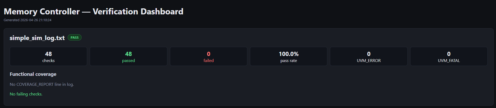
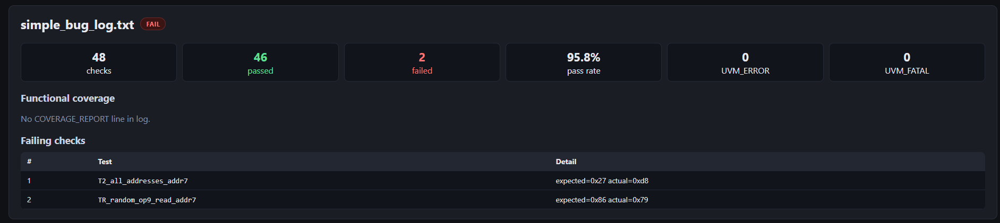
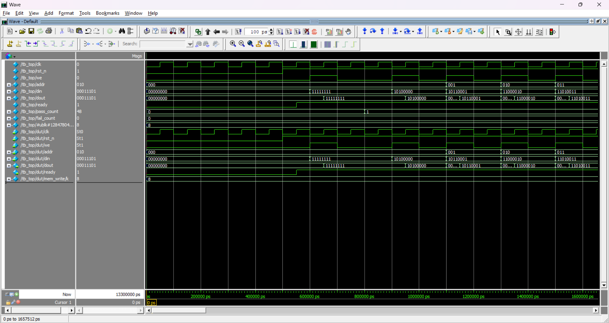
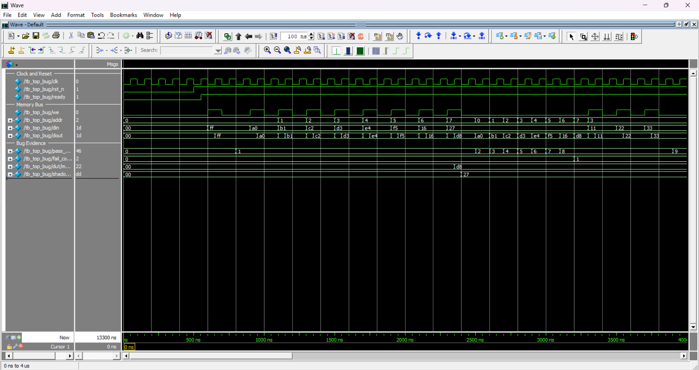

# SystemVerilog UVM Verification of an SRAM Memory Controller

> **Block-level UVM verification environment for an 8×8 SRAM controller — featuring constrained-random stimulus, a shadow-memory scoreboard, functional coverage with cross and transition bins, regression automation with Python-based log parsing, and an intentional bug-injection flow that proves the environment catches real silicon-like failures.**

---

## Project Highlights

| Aspect | Detail |
|---|---|
| **DUT** | 8-location × 8-bit synchronous-write / combinational-read SRAM controller |
| **Verification Methodology** | UVM 1.2 (full environment: test → env → agent → sequencer / driver / monitor → scoreboard / coverage) |
| **Language** | SystemVerilog (RTL + testbench) · Python 3 (regression & dashboard) · TCL (simulation automation) |
| **Simulator** | Questa (UVM flow) · ModelSim Intel Starter (simple flow) |
| **Stimulus** | Directed sequences · boundary-value sequences · sequential-pattern sequences · constrained-random sequences (100–200 transactions) |
| **Checking** | Self-checking scoreboard with `shadow_mem[0:7]` reference model; PASS/FAIL printed per read check |
| **Coverage** | Address bins (0–7) · operation bins (read/write) · data-class bins (zero, all-ones, low-mid, high-mid) · address×operation cross · address-transition coverage |
| **Automation** | TCL compile-and-run scripts · `regression.py` log parser with CI exit codes · `dashboard.py` HTML report generator · GitHub Actions CI skeleton |
| **Debug Evidence** | Intentional buggy DUT (`memory_ctrl_buggy.sv`) · scoreboard-caught mismatches · clean vs. failing dashboard screenshots · waveform screenshots |

---

## Why This Project Matters

This project demonstrates the core block-level verification skills used in ASIC and FPGA DV roles:

- **Reading a specification** and translating features into a verification plan with measurable coverage goals.
- **Architecting a UVM environment** from scratch — sequence items, sequences, driver, monitor, agent, scoreboard, coverage subscriber, environment, and test.
- **Generating diverse stimulus** — directed corner-case tests, boundary-value sweeps, sequential address patterns, and constrained-random traffic.
- **Building a self-checking scoreboard** that uses a reference model to automatically detect DUT mismatches without manual waveform inspection.
- **Defining functional coverage** with coverpoints, cross coverage, and transition bins to measure verification completeness.
- **Automating regression** with TCL scripts and Python-based log parsing that produce CI-friendly exit codes and an HTML dashboard.
- **Injecting and debugging real bugs** — proving the verification environment catches failures, not just passing tests.

---

## DUT Overview

The design under test is a minimal SRAM controller (`rtl/memory_ctrl.sv`):

| Property | Value |
|---|---|
| Depth | 8 locations |
| Width | 8 bits |
| Write | Synchronous — captured on `posedge clk` when `we == 1` |
| Read | Combinational — `dout = mem[addr]` |
| Reset | Active-low asynchronous — clears all 8 locations to `8'h00` |
| Ready | `ready = 0` during reset, `ready = 1` after reset release |

Port list: `clk`, `rst_n`, `we`, `addr[2:0]`, `din[7:0]`, `dout[7:0]`, `ready`.

The focus of this project is the **verification environment**, not the RTL complexity.

---

## UVM Testbench Architecture

```
tb_top_uvm
 ├── clk_gen (10 MHz, always #50 toggle)
 ├── mem_if  (SystemVerilog interface + tb_valid handshake signal)
 ├── DUT: memory_ctrl  /  memory_ctrl_buggy  (selected via +define+USE_BUGGY_DUT)
 └── UVM
     └── mem_base_test
         └── mem_env
             ├── mem_agent
             │   ├── mem_sequencer  (uvm_sequencer #(mem_seq_item))
             │   ├── mem_driver     (drives we/addr/din, pulses tb_valid)
             │   └── mem_monitor    (samples on posedge clk + 1ns when tb_valid == 1)
             ├── mem_scoreboard     (shadow_mem reference model, PASS/FAIL per read)
             └── mem_coverage       (covergroups: address, operation, data, cross, transitions)
```

### Transaction Flow

```
Sequence ──→ Sequencer ──→ Driver ──→ mem_if ──→ DUT
                                        │
                                    Monitor (analysis port)
                                     ╱          ╲
                              Scoreboard     Coverage
```

**Key UVM mechanisms used in this codebase:**
- `uvm_config_db#(virtual mem_if)::set / get` — virtual interface distribution from `tb_top_uvm` to driver and monitor.
- `uvm_analysis_port` / `uvm_analysis_imp` — monitor broadcasts observed transactions to both scoreboard and coverage subscriber.
- `uvm_subscriber` — `mem_coverage` extends `uvm_subscriber#(mem_seq_item)` for automatic analysis port connection.
- `run_test("mem_base_test")` — called from `tb_top_uvm` initial block to launch the UVM phasing mechanism.
- `phase.raise_objection / drop_objection` — controls simulation end-of-test in `mem_base_test`.
- `uvm_do_with` / `uvm_do` — inline sequence item creation with constraints in all three sequences.

---

## Verification Plan

| Feature ID | DUT Feature | Test Strategy | Coverage / Checking |
|---|---|---|---|
| F1 | 8-location × 8-bit memory | T2: write all 8 addrs with distinct data, read all back | `cp_addr` bins 0–7 (100% goal) |
| F2 | Synchronous write (`posedge clk`) | T1: write 0xFF to addr 0, read back; T3: triple overwrite addr 3 | Scoreboard `shadow_mem` update on every write |
| F3 | Combinational read | Every read transaction checked by scoreboard | `cp_op` read_op bin |
| F4 | Active-low async reset clears memory | T4: reset after writes, confirm 0x00; T5: read all addrs after reset | Scoreboard shadow reset to 0x00 |
| F5 | `ready` behavior | T4/T5: reset sequence confirms ready transitions | Visual waveform evidence |
| — | Boundary data values | `mem_directed_seq`: 0x00 and 0xFF written to all 8 addresses | `cp_data` zero / all_ones bins |
| — | Overwrite correctness | T3: three consecutive writes to addr 3, read confirms latest value | Scoreboard comparison |
| — | Sequential access pattern | `mem_sequential_seq`: ascending write 0–7, then ascending read 0–7 | `cp_trans` same_addr / diff_addr bins |
| — | Constrained-random | `mem_random_seq`: 100–200 randomized read/write transactions | `cross_addr_op` cross coverage |

---

## Stimulus Strategy

### Directed Tests — `mem_directed_seq`
- **T1**: Write `0xFF` to address 0, read back — basic write/read sanity.
- **T2**: Write addresses 0–7 with data `0xA0 + i`, read all back — full address range.
- **T3**: Triple overwrite address 3 (`0x11 → 0x22 → 0x33`), read back — latest-value correctness.
- **Boundary sweep**: Write `0x00` then `0xFF` to every address and read back — boundary data coverage.

### Sequential Pattern — `mem_sequential_seq`
- Ascending writes: address 0 → 7 with data `0x10 + i`.
- Ascending reads: address 0 → 7 — verifies data integrity in order.
- Exercises address-transition coverage (`same_addr` / `diff_addr` bins).

### Constrained-Random — `mem_random_seq`
- Generates 100–200 fully random transactions (controlled by `constraint c_n`).
- `addr ∈ [0:7]`, `din ∈ [0:255]`, `we` randomly toggled via `rand bit`.
- Each read is automatically checked by the scoreboard — no manual expected values needed.
- `mem_base_test` overrides `n_trans` to 120 via inline randomize constraint.

---

## Scoreboard Strategy

The scoreboard (`mem_scoreboard`) is the central self-checking component. It uses a **shadow memory** as a transaction-level reference model:

```
┌───────────────────────────────────────────────────────────┐
│                    mem_scoreboard                         │
│                                                           │
│   bit [7:0] shadow_mem [0:7]    ← initialized to 0x00    │
│                                                           │
│   On write transaction:                                   │
│     shadow_mem[addr] = din      ← update reference        │
│                                                           │
│   On read transaction:                                    │
│     if (dout === shadow_mem[addr])                         │
│       → PASS, increment pass_count                        │
│     else                                                  │
│       → FAIL, increment fail_count                        │
│       → uvm_error with expected=0xNN actual=0xNN          │
│                                                           │
│   report_phase:                                           │
│     SCOREBOARD_SUMMARY total=N pass=N fail=N              │
└───────────────────────────────────────────────────────────┘
```

**Key design decisions:**
- The scoreboard subscribes to the monitor's `uvm_analysis_port` via `uvm_analysis_imp`, receiving every observed transaction automatically.
- The `write()` function determines read vs. write by checking `t.we`.
- Each read check is given a unique name (`read_chk<N>_addr<N>`) for traceability in logs.
- Mismatches use `uvm_error` (not `uvm_fatal`) so the simulation continues and all failures are collected.
- `fail_count` is used by `regression.py` to determine the overall pass/fail status.
- PASS/FAIL output format is regex-friendly, enabling automated log parsing.

---

## Functional Coverage

The coverage subscriber (`mem_coverage`) extends `uvm_subscriber#(mem_seq_item)` and contains two covergroups:

### `cg_mem` — Main covergroup
| Coverpoint | Bins | Goal |
|---|---|---|
| `cp_addr` | `{0, 1, 2, 3, 4, 5, 6, 7}` — one bin per address | 100% |
| `cp_op` | `write_op = {1}`, `read_op = {0}` | 100% |
| `cp_data` | `zero = {0x00}`, `all_ones = {0xFF}`, `low_mid = {0x01:0x7F}`, `high_mid = {0x80:0xFE}` | 100% |
| `cross_addr_op` | Cross of `cp_addr` × `cp_op` (16 bins total) | 100% |

### `cg_addr_trans` — Address transition covergroup
| Coverpoint | Bins | Goal |
|---|---|---|
| `cp_trans` | `same_addr` (previous == current), `diff_addr` (previous ≠ current) | 100% |

**Coverage reporting**: In `report_phase`, individual coverpoint percentages and a computed overall average are printed in a `COVERAGE_REPORT` line that `dashboard.py` parses with a regex to populate the HTML coverage bars.

---

## Bug Injection Demo

A key strength of this project is **proving the environment actually catches bugs**, not just passing clean runs.

### The Bug
`rtl/memory_ctrl_buggy.sv` contains an intentional corruption:
```systemverilog
if (addr == 3'd7)
    mem[addr] <= din ^ 8'hFF;   // data is bit-inverted at address 7
else
    mem[addr] <= din;            // all other addresses are correct
```

### What Happens
| Scenario | DUT Used | Expected Result |
|---|---|---|
| Clean regression (`run_uvm.tcl`) | `memory_ctrl` | All PASS — scoreboard `fail_count == 0` |
| Bug regression (`run_uvm_bug.tcl`) | `memory_ctrl_buggy` | FAIL at address 7 — scoreboard reports `expected=0xNN actual=0xNN` |

### Why This Matters
- The **directed sequence** writes `0x00` and `0xFF` to all 8 addresses — address 7 is guaranteed to be hit, triggering corrupted values `0xFF` and `0x00`.
- The **random sequence** (120 transactions) statistically hits address 7 multiple times.
- The **scoreboard** catches every mismatch and reports it with expected/actual values.
- The **dashboard** surfaces failing checks under a red FAIL badge, making triage immediate.
- This demonstrates a real **detect → debug → fix** workflow used in industry DV.

---

## Results

| Run | Script | Expected Outcome | Evidence |
|---|---|---|---|
| Simple testbench | `run_simple.tcl` | All PASS (directed T1–T5 + 50 random ops) | Console log |
| UVM clean regression | `run_uvm.tcl` | All PASS, `fail_count == 0`, coverage ≈ 100% | Dashboard screenshot below |
| UVM bug regression | `run_uvm_bug.tcl` | FAIL at address 7, `fail_count > 0` | Dashboard screenshot below |
| HTML dashboard | `dashboard.py` | Generates `reports/dashboard.html` with pass/fail KPIs and coverage bars | Screenshot below |

### Clean Regression Dashboard



### Bug Regression Dashboard



### Waveform — Clean Reset Behavior



### Waveform — Address 7 Bug Caught



In the bug waveform, the DUT stores `din ^ 0xFF` at address 7 while the scoreboard's shadow memory holds the correct expected value, causing `fail_count` to increment.

---

## How to Run

> **Requirements**: Questa (for UVM flow) or ModelSim Intel Starter (for simple flow only). Python 3.x with `tabulate` (`pip install -r requirements.txt`).

### Simple Flow (no UVM required)
```powershell
vsim -c -do scripts/run_simple.tcl
python tools/regression.py reports/simple_sim_log.txt
```

### UVM Clean Regression
```powershell
vsim -c -do scripts/run_uvm.tcl
python tools/regression.py reports/uvm_sim_log.txt
```

### UVM Bug Demo
```powershell
vsim -c -do scripts/run_uvm_bug.tcl
python tools/regression.py reports/uvm_bug_log.txt
```

### HTML Dashboard
```powershell
python tools/dashboard.py reports/uvm_sim_log.txt reports/uvm_bug_log.txt
# Open reports/dashboard.html in a browser
```

### Cleanup
```powershell
powershell -ExecutionPolicy Bypass -File scripts/clean.ps1
```

> **Linux/macOS**: Same commands — swap `python` for `python3`. For cleanup: `rm -rf work transcript reports/*.txt waveform.vcd`.

---

## Repository Structure

```
memory-ctrl-verification/
├── rtl/
│   ├── memory_ctrl.sv              # Clean DUT
│   └── memory_ctrl_buggy.sv        # Intentionally buggy DUT (addr 7 corruption)
├── tb/
│   ├── simple/                     # Task-based testbench (no UVM)
│   │   ├── tb_top.sv
│   │   └── mem_test.sv
│   └── uvm/                        # Full UVM environment
│       ├── mem_seq_item.sv          # Transaction class
│       ├── mem_sequence.sv          # Directed, random, sequential sequences
│       ├── mem_driver.sv            # Drives transactions onto mem_if
│       ├── mem_monitor.sv           # Observes DUT via analysis port
│       ├── mem_scoreboard.sv        # Shadow-memory reference model + checker
│       ├── mem_coverage.sv          # Functional coverage subscriber
│       ├── mem_agent.sv             # Bundles sequencer/driver/monitor
│       ├── mem_env.sv               # Top-level UVM environment
│       ├── mem_base_test.sv         # Default test: directed → sequential → random
│       ├── mem_if.sv                # SystemVerilog interface
│       ├── mem_uvm_pkg.sv           # Package with compile-order includes
│       └── tb_top_uvm.sv            # Testbench top module
├── scripts/
│   ├── run_simple.tcl               # TCL: compile + simulate simple flow
│   ├── run_uvm.tcl                  # TCL: compile + simulate UVM clean
│   ├── run_uvm_bug.tcl              # TCL: compile + simulate UVM with buggy DUT
│   └── clean.ps1                    # PowerShell cleanup script
├── tools/
│   ├── regression.py                # Log parser with CI exit codes (0/1/2)
│   └── dashboard.py                 # HTML dashboard generator
├── docs/
│   ├── verification_plan.md         # Formal verification plan
│   ├── architecture.md              # UVM architecture documentation
│   ├── results_template.md          # Run-results recording template
│   └── img/                         # Dashboard + waveform screenshots
├── reports/                         # Simulation logs + dashboard output
├── .github/workflows/regression.yml # CI: Python checks + repo structure validation
└── requirements.txt                 # Python dependencies (tabulate)
```

---

## DV Skills Demonstrated

- **SystemVerilog testbench development** — RTL design, interfaces, packages, `always_ff`, `assign`
- **UVM component architecture** — test, env, agent, sequencer, driver, monitor, scoreboard, coverage subscriber
- **Transaction-level modeling** — `mem_seq_item` with `rand` fields, constraints, `uvm_field_*` macros, `convert2string`
- **Constrained-random stimulus** — `uvm_do_with` inline constraints, `rand int unsigned` transaction count, multiple sequence types
- **Self-checking scoreboard** — shadow memory reference model, automatic PASS/FAIL classification, `uvm_analysis_imp`
- **Functional coverage** — coverpoints, cross coverage, transition coverage, `report_phase` summary
- **Regression automation** — TCL scripts for compilation and simulation, Python log parser with regex-based extraction
- **Failure triage and debug** — intentional bug injection, scoreboard error messages with expected/actual, dashboard failure listing
- **TCL scripting** — parameterized compile flows, `+define+` DUT selection, transcript redirection, library management
- **Python scripting** — regex log parsing, HTML report generation, CI-friendly exit codes, `tabulate` integration
- **Waveform-based debug** — VCD dump enabled, waveform screenshots showing reset behavior and bug manifestation

---

## Interview Talking Points

1. **Why UVM?** — UVM provides a standardized, reusable verification architecture. The sequencer/driver/monitor split decouples stimulus generation from protocol driving and DUT observation, making it easy to add new tests without modifying infrastructure.

2. **How the scoreboard works** — The scoreboard maintains a `shadow_mem[0:7]` array as a golden reference. On every write observed by the monitor, it updates the shadow. On every read, it compares `dout` against the shadow and reports PASS or FAIL. This is the same reference-model approach used in production ASIC verification.

3. **How the bug demo proves the environment** — If a verification environment only ever sees passing tests, you can't be confident it would catch a real bug. The `memory_ctrl_buggy` DUT introduces a targeted data corruption at address 7. The scoreboard detects it, `regression.py` returns exit code 1, and the dashboard highlights the failing checks — end-to-end proof.

4. **How coverage closure is approached** — The directed sequence guarantees all 8 addresses, both operations, and boundary data values are hit. The sequential sub-sequence exercises address transitions. The random sequence (120 transactions) fills remaining cross-coverage bins. The `report_phase` prints per-coverpoint percentages so gaps are immediately visible.

5. **What I would add next** — SystemVerilog Assertions for protocol-level checks, code coverage merging from the simulator, parameterized DUT width/depth, an APB/AXI-Lite wrapper to verify a bus-accessible memory, and negative tests for invalid addresses or back-to-back resets.

---

## Future Improvements

- **SystemVerilog Assertions (SVA)** — add protocol-level assertions for write-to-read latency, reset-to-ready timing, and bus-hold conditions.
- **Code coverage integration** — merge functional coverage with line/toggle/FSM coverage from the simulator for a unified closure report.
- **GitHub Actions with self-hosted runner** — enable the `sv-simulation-self-hosted` CI job (already scaffolded in `regression.yml`) once a Questa-equipped runner is registered.
- **APB/AXI-Lite wrapper** — wrap the memory controller with a standard bus interface to demonstrate protocol-level verification.
- **Parameterized DUT** — make depth and width configurable, and scale the testbench coverage model accordingly.
- **Negative / error-injection tests** — back-to-back resets, writes during reset, read-after-write hazard sequences.
- **Coverage report export** — generate UCDB or XML coverage databases for use with Questa's coverage tools.
- **Reusable verification package** — restructure into a reusable VIP-style package that can be dropped into other memory-controller projects.

---

## CV Bullets

> - Designed and implemented a **UVM verification environment** for an SRAM memory controller in SystemVerilog, including a constrained-random sequencer, shadow-memory scoreboard, and functional coverage model with address, data-class, cross, and transition coverpoints — achieving 100% coverage closure across directed and random stimulus.
> - Built a **regression automation framework** with TCL simulation scripts, a Python log parser with CI-compatible exit codes, and an HTML dashboard; demonstrated end-to-end bug detection through intentional fault injection, scoreboard mismatch reporting, and failure triage using waveform analysis.

---

<p align="center"><i>Built as a Design Verification portfolio project · SystemVerilog · UVM · Questa</i></p>